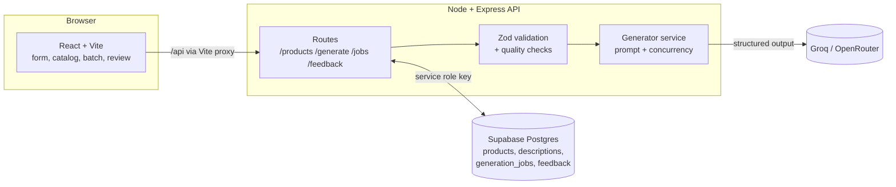

# Build plan: Retail Product Description Generator

TCS Technology Day problem statement: a GenAI tool that turns structured product attributes into engaging, consistent, SEO-friendly product descriptions, with batch processing and a simple web UI.

This plan covers what to build, in what order, and how to show the judges that each requirement is met.

---

## 1. What the judges will check

Each requirement in the problem statement maps to a feature and to the phase that delivers it.

| Requirement (from the problem statement) | How we meet it | Phase |
|---|---|---|
| Input structured attributes, output engaging, coherent descriptions | `POST /api/generate` with Groq or OpenRouter, JSON output validated by Zod | 0 ✅ / 1 |
| Tailored to the retail domain | Category-aware system prompt, tone presets, brand voice notes | 0 ✅ / 1 |
| **Batch processing** | CSV/JSON upload → batch job with concurrency, progress and export | 3 |
| **Style consistency** | Fixed system prompt, tone presets, saved brand voice, few-shot style references, consistency check across a batch | 1 / 5 |
| **SEO keyword inclusion** | Seed keywords in, SEO keywords and meta description out, automated keyword-coverage checks | 0 ✅ / 5 |
| **85%+ relevance/creativity feedback** | 1–5 ratings stored in `feedback`, dashboard shows the % rated 4 or higher | 4 |
| **At least 50 products in the demo** | Synthetic generator produces 60 diverse products; batch-generate them all live | 0 ✅ / 3 |
| Simple web UI for attribute input and output viewing | React app: single-product form, catalog, batch, review pages | 0 ✅ / 2–4 |
| Basic docs on data format and usage | `README.md`, `docs/DATA_FORMAT.md` | 0 ✅ / 6 |
| Demo video of the generation workflow | Scripted 3–4 minute recording (section 8) | 6 |
| Data: CSV/JSON attributes, image metadata, synthetic data scripts, quality checks | `scripts/generate-synthetic.js`, `image_url` field, `checkCompleteness` | 0 ✅ |
| No personal or sensitive data | Synthetic products with fictional brands only | 0 ✅ |

✅ means it is already in the repo.

---

## 2. Architecture

Key decisions:

- **All database access goes through Express.** The browser holds only the Supabase publishable key, used for login (Supabase Auth). RLS is enabled with no policies, so that key can read no data; the server checks the user's access token and uses the secret key, which bypasses RLS.
- **Structured outputs.** The model returns JSON validated against a Zod schema (`GeneratedDescription`), so there is no fragile text parsing.
- **Mock provider.** With no API key the server returns template text. The UI, batch flow and tests all work offline, and the demo has a fallback if the network fails.
- **Provider and model are configurable, and free.** Groq is the default (`GROQ_MODEL=openai/gpt-oss-120b`, `GROQ_REASONING_EFFORT=low`, `GROQ_TEMPERATURE` trades consistency for creativity). OpenRouter's free models are the alternative and extra capacity (`OPENROUTER_MODEL`, default `nvidia/nemotron-3-super-120b-a12b:free`). `LLM_PROVIDER` picks one; switching needs no code changes. Claude support was removed to keep the build free; it is in git history (commit `db22889`) if a paid key becomes available.
- **Free-tier limits.** Groq's free tier for `gpt-oss-120b` allows 8K tokens a minute and 200K a day per model (about 40 descriptions a day with the current 4K-token prompt). Free OpenRouter models allow 20 requests a minute and 50 a day. The server waits out per-minute limits and fails fast with a clear message on daily ones. This shapes phases 3 and 6: a 60-product batch needs more than one day's quota on one model, so spread it across models or providers, or over two days (see section 7).

---

## 3. Data model (Supabase)

Defined in `supabase/migrations/20261008000000_init.sql`:

| Table | Purpose | Key columns |
|---|---|---|
| `products` | Input attributes | `sku` (unique), `name`, `category`, `features` jsonb, `specifications` jsonb, `attributes` jsonb, `seed_keywords` text[], `completeness_score` |
| `generation_jobs` | One row per batch run | `status`, `options` (tone/length/voice/model), `total`, `succeeded`, `failed` |
| `descriptions` | Generated copy, versioned per product | `product_id`, `job_id`, `version`, `title`, `long_description`, `bullet_points`, `seo_keywords`, `meta_description`, `quality` jsonb, token counts, `status` (draft/approved/rejected) |
| `feedback` | Human ratings | `description_id`, `relevance` 1–5, `creativity` 1–5, `comment` |

---

## 4. API surface

| Method & path | What it does | Status |
|---|---|---|
| `GET /api/health` | Provider, model, DB connectivity | ✅ |
| `GET /api/generate/options` | Available tones and lengths | ✅ |
| `POST /api/generate/check` | Completeness score and `sparse` flag, before generating | ✅ (phase 1) |
| `POST /api/generate` | Generate for one product (no DB needed); `quality` includes the fact check | ✅ |
| `GET /api/products` | List products (filter by category, search, paginate) | Phase 2 |
| `POST /api/products` | Create or update one product | Phase 2 |
| `POST /api/products/import` | Upload a CSV or JSON file, validate, upsert, return per-row errors | Phase 2 |
| `POST /api/products/:id/generate` | Generate and save a new description version | Phase 2 |
| `GET /api/products/:id/descriptions` | Version history for a product | Phase 2 |
| `POST /api/jobs` | Start a batch: `{ productIds \| filter, options }` | Phase 3 |
| `GET /api/jobs/:id` | Job progress plus results so far | Phase 3 |
| `GET /api/jobs/:id/export?format=csv\|json` | Download results | Phase 3 |
| `PATCH /api/descriptions/:id` | Approve, reject or hand-edit | Phase 4 |
| `POST /api/descriptions/:id/feedback` | Submit relevance and creativity ratings | Phase 4 |
| `GET /api/metrics` | % rated ≥4, average scores, SEO pass rate, tokens and cost | Phase 4 |

---

## 5. Step-by-step phases

Phases are in priority order. Each one ends with something you can demo. If time runs short, **phases 0–4 plus the demo (phase 6) cover every requirement**; phase 5 and the stretch goals are polish.

### Phase 0: Foundation ✅ (done in this commit)

- [x] Monorepo with npm workspaces: `client/` (React + Vite), `server/` (Express 5)
- [x] `npm run dev` starts both; Vite proxies `/api` to Express
- [x] Env config with `.env.example`; Supabase client (service role, server only)
- [x] Supabase schema migration with RLS enabled
- [x] Zod schemas for product input, options and generated output
- [x] Groq generator with validated JSON output, plus an offline mock provider
- [x] Rule-based quality checks: input completeness and SEO checks
- [x] Single-product UI: form, tone/length/brand voice, result panel with quality checks
- [x] Synthetic data script (60 products, 7 categories) and Supabase seed script
- [x] API tests with `node:test`

**Your setup steps:**

1. `npm install`
2. Create a Supabase project. In the SQL editor, run `supabase/migrations/20261008000000_init.sql`.
3. `cp server/.env.example server/.env` and fill in `SUPABASE_URL`, `SUPABASE_SECRET_KEY` and `GROQ_API_KEY`.
4. `npm run db:seed` to load the 60 synthetic products.
5. `npm run dev`, open http://localhost:5173 and check that the header badge shows the model and `DB: connected`.

### Phase 1: Generation quality (core of the score)

The judges' 85% target depends on this phase, so start it first and keep improving it throughout.

**Status:** the tooling and the first prompt revision are done; what remains needs a live model and human raters (see "Still to do" below).

1. [x] **Build a small eval set.** `data/eval/products.json`: 15 products, at least 2 per category, 4 sparse records, and deliberate traps (seed keywords that contradict the specs, such as "sunscreen spf 50" on an SPF 30 product, and names that disagree with the specs). Each product has `eval_notes` telling raters what to check.
2. [x] **Write an eval script** (`server/scripts/eval.js`, `npm run eval`). It generates for every eval product in each chosen tone and writes `data/eval/report.md` (per-model summary, every fact-check flag, then each product's data beside its copy and checks), `results.json` (raw results tagged with a prompt-version hash) and a blank `ratings.csv`. `npm run eval -- ratings <files>` summarises the team's ratings.
3. [x] **Add a fact-check pass** to `quality.js` (`checkFacts`, returned as `quality.facts`). It pulls every number, unit and code out of the copy (`32 hours`, `5.3`, `IPX5`, `SPF 50`) and flags any that don't appear in the input with the same unit. It also flags unsupported claim words (organic, waterproof, certified, clinically proven and so on). Seed keywords don't count as evidence.
4. [x] **Tune the prompt** in `server/src/prompts/productDescription.js` (first revision, written from the eval set's failure modes):
   - [x] Per-category guidance (what buyers care about in apparel vs. electronics vs. grocery)
   - [x] Tone definitions: one line each for all six tones (a test keeps them in sync with `TONES`)
   - [x] **Few-shot style references:** 4 fictional examples (technical, friendly, luxury, and a sparse playful one) covering four categories. Tests check that each example passes the SEO checks, the fact check and its own word count. The system prompt is now about 3,300 tokens.
   - [x] Accuracy rules for the eval set's traps: never upgrade ratings (IPX5 is not waterproof), treat seed keywords as search terms rather than facts, trust specs over the product name, don't quote the price.
   - [x] A fixed bullet format ("Benefit phrase: fact") and a primary-keyword rule that matches the SEO checks, for consistency across the catalog.
   - [x] Baseline run on the live model (`report-baseline.md`, 30 generations): every trap handled and no fact-check flags, but the copy read as machine-written (stock "For those who" openers, keyword stuffing, narrating the data, inconsistent title case). Prompt v2 targets these, and a **style check** (`checkStyle`, returned as `quality.style`) now measures them. v2 on the 8 worst products (`report-v2.md`): style-clean outputs went from 1/8 to 5/8.
   - [ ] Keep iterating against live outputs: read the report, change one thing, re-run the same slice with a new `--label`.
5. [ ] **Choose model and effort.** `npm run eval -- --provider groq --models a,b --efforts low,medium` runs each combination on the same products and the report compares them side by side; run it once per provider with a different `--label` to compare providers. Compare Groq `openai/gpt-oss-120b` (effort `low` and `medium`) with OpenRouter's `nvidia/nemotron-3-super-120b-a12b:free` on a 10-product, one-tone slice. Pick the fastest setting the team rates as good enough.
6. **Handle incomplete products.**
   - [x] Server: `checkCompleteness` returns `sparse: true` below 50. For sparse products the prompt asks for a 40-70 word description and 3 bullets built only from the facts given, whatever length was requested. `POST /api/generate/check` returns the score before generating.
   - [ ] UI (frontend): call `/api/generate/check` before generating, and show a warning with the missing items when `sparse` is true. Show `quality.facts.unsupported` in the result panel.

*Public style references:* the Amazon product datasets on Kaggle and Hugging Face are good sources for real description styles. Use them only as style references in the prompt, not as product data.

**Still to do:** set `OPENROUTER_API_KEY` in `server/.env`, run `npm run eval -- --tones friendly,luxury` (30 requests, within the free daily quota), have the team rate the outputs, then iterate on the prompt and pick a model.

**Done when:** the team rates 80%+ of the eval outputs 4 or 5, and the fact-check finds no invented numbers.

### Phase 2: Catalog and persistence

> **Basic version done:** `routes/products.js` (list, detail, CSV/JSON import, sample import, generate + save version) and a Catalog tab with import, table, per-product generate and a simple client-side "Generate all missing" batch. Still to do: pagination, editing products, a `/catalog/:id` version history view, and the server-side job runner in phase 3.

1. **Server:** add `routes/products.js` with list (filters: category, search on name/sku, pagination), create/update, and get-by-id.
2. **Import endpoint.** Accept a JSON array or a CSV upload (`multer` for multipart, `csv-parse` for CSV). Parse CSV with the conventions in `DATA_FORMAT.md`, validate each row with `ProductInput.safeParse`, compute `completeness_score`, and upsert on `sku`. Return `{ inserted, updated, errors: [{ row, issues }] }` so the UI can show exactly which rows failed.
3. **Persist generations.** Add `POST /api/products/:id/generate`, which saves into `descriptions` with `version = max + 1`, plus a route for the version history.
4. **Client:** add `react-router-dom` and pages:
   - `/` Generate (current page)
   - `/catalog`: products table with category filter, completeness badge, and a "latest description" preview
   - `/catalog/:id`: attributes on the left, description versions on the right, with a "Regenerate" button
   - `/import`: drag-and-drop CSV/JSON, preview the first rows, then confirm, then show per-row errors
5. **Tests:** CSV parsing round-trip using `data/generated/products.csv`, and the import route rejecting bad rows.

**Done when:** you can upload `data/generated/products.csv`, see 60 products in the catalog, and generate and view versions for any of them.

### Phase 3: Batch processing (the 50+ products requirement)

1. **Job runner** (`services/batch.js`):
   - `POST /api/jobs` creates a `generation_jobs` row (`queued`), responds immediately with the job id, then processes in the background.
   - Run with a concurrency limit (`GENERATION_CONCURRENCY`, default 5) using a small promise pool. No extra library is needed, or use `p-limit`.
   - After each product, insert into `descriptions` (with `job_id`) and increment `succeeded` or `failed`.
   - Retries: `server/src/lib/llm.js` already retries 429 and 5xx with backoff. On final failure, record the error on the product and continue. Never fail the whole job for one product.
   - Final status: `completed`, `partial` (some failed) or `failed`.
2. **Progress:** the client polls `GET /api/jobs/:id` every 2 seconds for a progress bar and a live results table. Polling is simpler and more reliable for a demo than websockets. Supabase Realtime is an optional upgrade.
3. **Batch page** (`/batch`): select products (all, by category, or a checkbox list), choose tone, length and brand voice, start, watch progress, then export.
4. **Export:** CSV and JSON download of the job's results (sku, title, descriptions, bullets, keywords, meta, quality).
5. **Resilience:** if the server restarts mid-job, a "Resume" button reprocesses products in the job that have no description yet.

**Done when:** all 60 products generate in one batch with a visible progress bar and export to CSV. Time it: at concurrency 5, expect a few minutes, and tune concurrency or effort if it is too slow for a live demo.

### Phase 4: Review, feedback and metrics (the 85% metric)

1. **Review queue** (`/review`): one description at a time next to its attributes, with 1–5 stars for **relevance** and **creativity**, an optional comment, and approve/reject. Keyboard shortcuts (1–5, A, R, →) make rating 50+ items fast.
2. Inline editing of a description before approving. Store the edit as a new version so you can show how much humans changed the copy.
3. **Metrics endpoint and dashboard** (`/dashboard`):
   - **% of rated descriptions with relevance ≥ 4 and creativity ≥ 4** (the headline 85% number)
   - Average relevance and creativity, by category and by tone
   - SEO check pass rate, keyword coverage and fact-check flags
   - Products generated, tokens used and estimated cost
4. **Get real ratings:** before the demo, have every team member (and ideally a few colleagues) rate the 60-product batch. Report the number honestly. The prompt work in phase 1 is what gets it above 85%.
5. *Optional:* an **LLM-as-judge** script that rates each description against a rubric (accuracy against attributes, persuasiveness, readability, SEO). Use it to pre-screen and as a second signal next to human ratings, not as a replacement.

**Done when:** the dashboard shows a real % rated ≥4 across 50+ rated descriptions.

### Phase 5: SEO and consistency polish

1. **Readability score** (Flesch reading ease) per description, aiming for 60+.
2. **Keyword checks:** primary keyword in the first 100 words, keyword density under about 3% (no stuffing), no duplicate titles across the catalog.
3. **Batch consistency check:** flag descriptions in a batch that reuse the same opening phrase, or whose tone drifts (length far from the batch median).
4. **Saved brand voice presets:** a `style_profiles` table (name, tone, voice notes, example descriptions) that you choose from a dropdown. This is a strong story for "style consistency at catalog scale".
5. **Auto-fix:** if a hard check fails (title > 70 characters, meta > 155), make one follow-up request asking the model to fix only that field.

### Phase 6: Docs, deploy and demo

1. Update `README.md` with screenshots and `docs/DATA_FORMAT.md` with the import endpoint.
2. **Deploy:** client on Vercel or Netlify, server on Render or Railway. Set the `CORS_ORIGIN` and API base URL; Supabase is already hosted.
3. **Pre-generate** the 60-product batch before demo day, so the dashboard and catalog are full even if the live call is slow. Keep the mock provider as an emergency fallback.
4. Record the demo video (section 8) and rehearse the live demo twice.

### Stretch goals (only after phases 0–4 are solid)

- **Image-aware copy:** send `image_url` to a vision model so the copy can describe color, style and look.
- **Multilingual output:** Hindi, Tamil and other Indian languages as a `language` option.
- **A/B variants:** generate two versions per product and let reviewers choose.
- **Batch API:** for very large catalogs (thousands of SKUs), a provider batch API (where available) processes requests asynchronously at lower cost.
- **Marketplace export formats** (Shopify CSV, Amazon flat file).

---

## 6. Suggested team split (3–4 people)

| Person | Owns |
|---|---|
| A: GenAI | Prompt, eval set and script, fact-check, model and effort choice (phase 1, then 5) |
| B: Backend | Products, import, jobs, export, metrics endpoints (phases 2–4 server side) |
| C: Frontend | Router and pages: catalog, import, batch, review, dashboard (phases 2–4 client side) |
| D: Data & demo | Synthetic data, style references, collecting ratings, docs, deploy, video (phase 6) |

With 2 people, merge A+D and B+C. Agree on API shapes in section 4 first so frontend and backend can work in parallel; the frontend can build against the mock provider from day one.

---

## 7. Risks and mitigations

| Risk | Mitigation |
|---|---|
| Model invents specs | Prompt rule plus the automated fact-check (phase 1, step 3); shown in review UI |
| Rate limits or slow batches during the demo | Concurrency limit, SDK retries, pre-generated batch, `low` effort or a faster model for the live run |
| No network or API key on demo day | Mock provider plus pre-generated results stored in Supabase |
| API key leaks | Keys live only in `server/.env` (git-ignored); the browser holds only the Supabase publishable key (for login) and never talks to the database or the LLM directly |
| Costs | Both LLM providers are used on free tiers; tokens and latency are shown per call and in eval reports |
| Free quotas run out (Groq ~40 descriptions a day per model, OpenRouter 50 requests a day) | Eval runs check the OpenRouter quota before starting; spread the 60-product demo batch across models, providers or two days, and store the results in Supabase |
| Ratings below 85% | Start phase 1 early, iterate prompts with the eval script, add few-shot references |

---

## 8. Demo script (3–4 minutes)

1. **Problem (20 s):** a large catalog, with manual copy that is slow, costly and inconsistent.
2. **Data (30 s):** show `products.csv`, then import it and point out the completeness warnings on incomplete rows (data quality checks).
3. **Single product (45 s):** fill the form and generate in "friendly", then regenerate in "luxury". Walk through the title, bullets, meta and the SEO checks passing.
4. **Batch (60 s):** select all 60 products, choose a brand voice and start. Show the progress bar, open a few results across categories to show consistent style, then export to CSV.
5. **Quality (45 s):** review queue with quick ratings, then the dashboard: **% rated ≥4**, SEO pass rate, fact-check flags, cost per product.
6. **Close (20 s):** architecture slide, what's next (images, multilingual, marketplace export).
